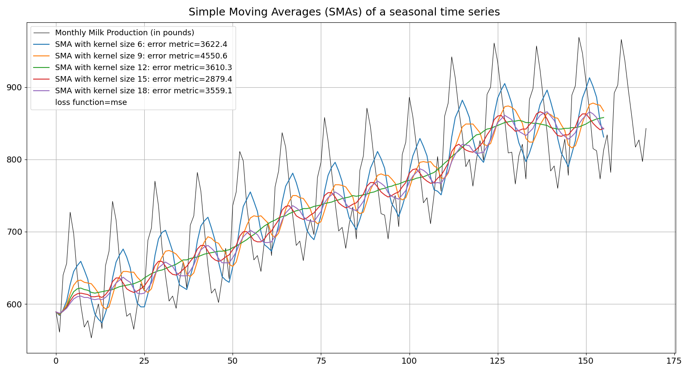
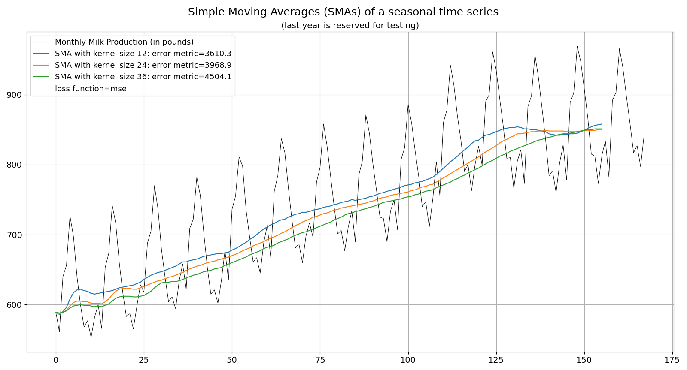
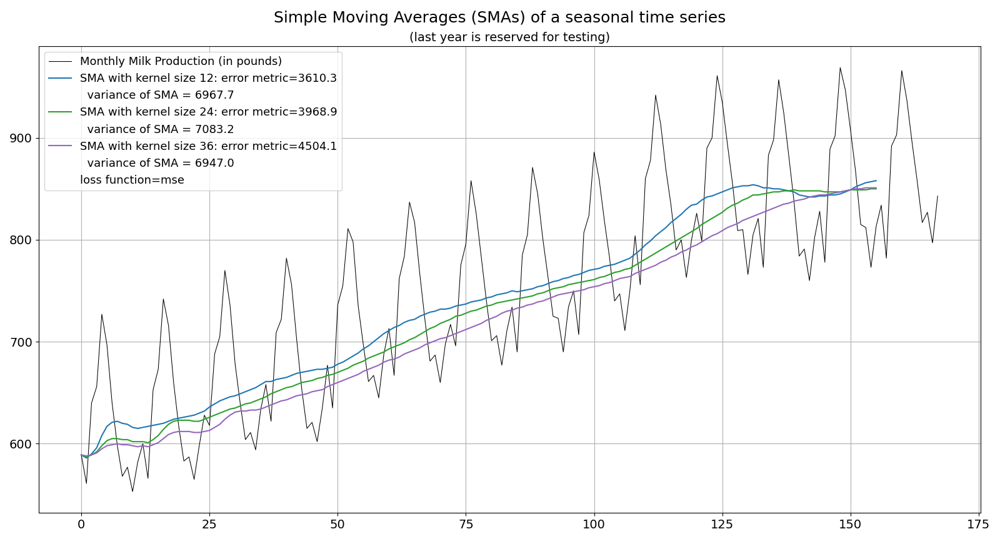
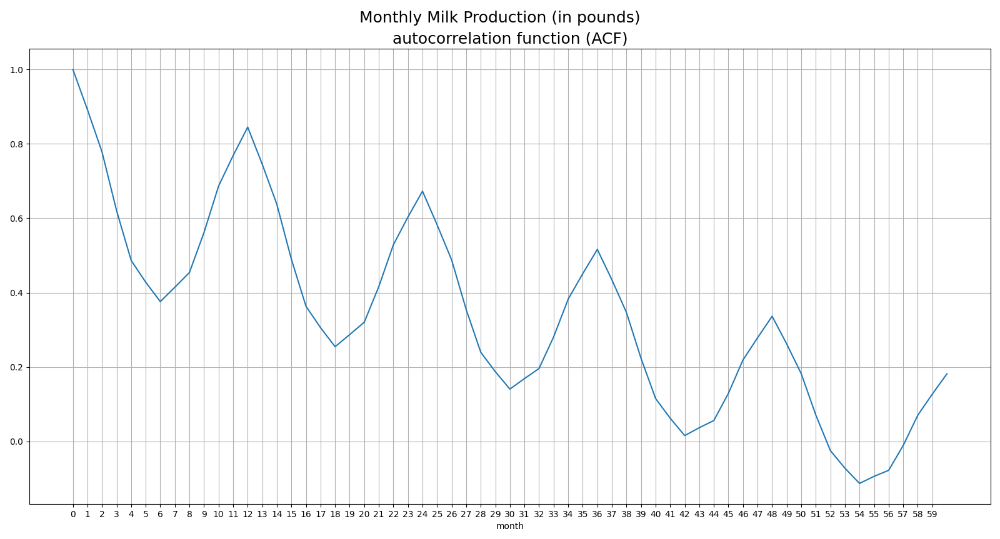

## A trend: what kind of moving average with what parameters?

In preparation of the **DLinear** model ("Decomposition-Linear": https://github.com/cure-lab/LTSF-Linear/blob/main/models/DLinear.py (+)) I came across questions how to implement the technical details of the decomposition of a time series.

The original paper only states:

*Specifically, DLinear is a combination of a Decomposition scheme used in Autoformer and FEDformer with linear layers. It first decomposes a raw data input into a trend component by a <u>moving average kernel</u> and a remainder (seasonal) component. Then, two one-layer linear layers are applied to each component, and we sum up the two features to get the final prediction. By explicitly handling trend, DLinear enhances the performance of a vanilla linear when there is a clear trend in the data.*

Again from: https://arxiv.org/abs/2205.13504

So, for example, what is a "clear trend" and how to spot it for separation from other components of a time series?

Numerous methods have been established to exactly answer these questions.

<br/>

The original source code (+) apparently is using some kind of **simple moving average** (https://en.wikipedia.org/wiki/Moving_average#Simple_moving_average), however with some padding on both sides of the original time series.

In my version, I'm not doing this. I still use a simple moving average, without any precise reasoning for doing so, but only pad on the left hand side of the original time series, so that all (simple) moving averages are starting with the first data point, that is the first month of milk production:

```
class SMANet(T.nn.Module):
    '''
    simple moving average
    '''
    def __init__(self, kernel_size):
        super().__init__()
        self.kernel_size = kernel_size
        self.sma = T.nn.AvgPool1d(kernel_size=kernel_size, stride=1)

    def forward(self, x):
        # the SMA's need some padding on the LHS of the time series:
        # https://pytorch.org/docs/stable/generated/torch.nn.AvgPool1d.html
        pad_lhs = T.nn.ConstantPad1d((self.kernel_size-1,0), (x[0,0]))
        x_padded = pad_lhs(x)
        sma = self.sma(x_padded)
        return sma
```

<br/>

Then comes up the question for the kernel size, that is the size of the look-back window. The original code has a fixed size of 25 data points, something which has been taken over from the Autoformer model:

*For DLinear, the moving average kernel size for decomposition is 25, which is the same as Autoformer.*

However, the original Autoformer paper from 2021/22 also does not answer the question why to choose a kernel size of 25: https://arxiv.org/abs/2106.13008

<br/>

So far I didn't find any **theoretical reasoning** why to prefer one moving average kernel size over the other.

In this paper (++)..

&nbsp;&nbsp;***Forecasting with moving averages***

&nbsp;&nbsp;Robert Nau, Fuqua School of Business, Duke University, August 2014: https://people.duke.edu/~rnau/Notes_on_forecasting_with_moving_averages--Robert_Nau.pdf

..I got the idea to experiment with kernel sizes ("model comparison"). That's why I have written this small utility: https://github.com/PLC-Programmer/PyTorch/blob/main/time_series_forecasting/DLinear/DLinear_monthly_milk_production_moving_averages.py






<br/>

So, a simple moving average of 12 months (**SMA12**) produces a "clear trend" output for this time series, the neighboring SMA9 and SMA15 do not!

However, SMA12 doesn't feature the lowest value at the loss function, here the common mean squared error (mse). Among the selected kernel sizes, SMA15 is doing this.

<br/>

Shouldn't a trend line also feature low "variability"?

So, I calculated the variance of some selected moving averages. SMA36, a moving average over 3 years, shows slightly lower variance than SMA12, but it's mse value is higher :confused:



=> one can see: choosing the "right" moving average model isn't easy


Paper (++) strongly features the concept of **residual autocorrelation** to check the quality of a moving average. I'm not so far yet because the residual component in our case is the other, the remainder (seasonal) component of the time series.

### Autocorrelation function (ACF)

However, I picked up this idea to apply an autocorrelation function (ACF) on the time series itself, featuring very clear annual peaks:



