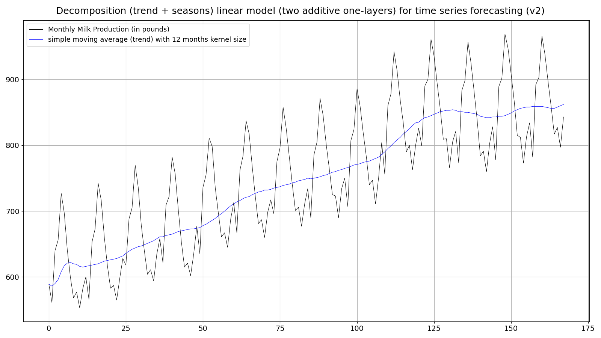

I've been experimenting with a (suitable) **decomposition** of the highly seasonal **monthly milk production** time series (https://github.com/PLC-Programmer/PyTorch/tree/main/time_series_forecasting/DLinear#autocorrelation-function-acf) and came to the conclusion that my two concepts I've working on did not surpass the prediction quality of the simple linear model: https://github.com/PLC-Programmer/PyTorch/tree/main/time_series_forecasting/Linear

I did a decomposition in the spirit of the original DLinear.py program (though I didn't copy this concept 1:1): https://github.com/cure-lab/LTSF-Linear/blob/main/models/DLinear.py

 

After disappointing results I did a concept (https://github.com/PLC-Programmer/PyTorch/blob/main/time_series_forecasting/DLinear/backup/DLinear_monthly_milk_production_forecasting2a.py) where the trend (moving average) component is completely separated from the remainder (seasonal) component, and only their independent predictions are finally added together. Also this concept was not superior to the Linear concept!

One reason for these disappointing results might be the fact that the trend of this time series is 'not clear' at its right hand side:

