## Synthetic times series

Sometimes it's easier to first experiment with synthetic times series ("deterministic curves") since it gives you more control over different setups.

I got this idea from here: https://github.com/tgchomia/ts/blob/main/Example.txt

So, this is the time series to experiment with, made of 700 datapoints (70 time units with equal 0.1 time steps):


Above is also a "quite seasonal" (univariate) time series, like the monthly milk production (from the real world):

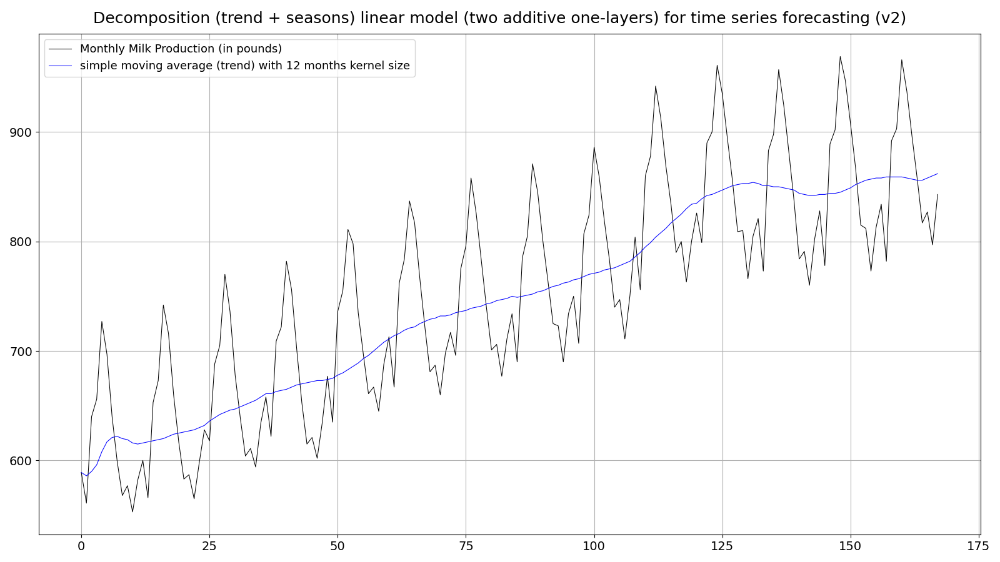

(link: https://github.com/PLC-Programmer/PyTorch/blob/main/time_series_forecasting/Are_transformers_effective_for_time_series_forecasting/DLinear/backup/monthly_milk_production_forecasting2_00a.png)

..but here made of only two harmonic oscillations. Albeit this synthetic times series doesn't feature a **trend**! Cf. https://github.com/PLC-Programmer/PyTorch/tree/main/time_series_forecasting/Are_transformers_effective_for_time_series_forecasting/DLinear

<br/>

However, starting with a one-layer (linear) model led to rather disappointing results like these:

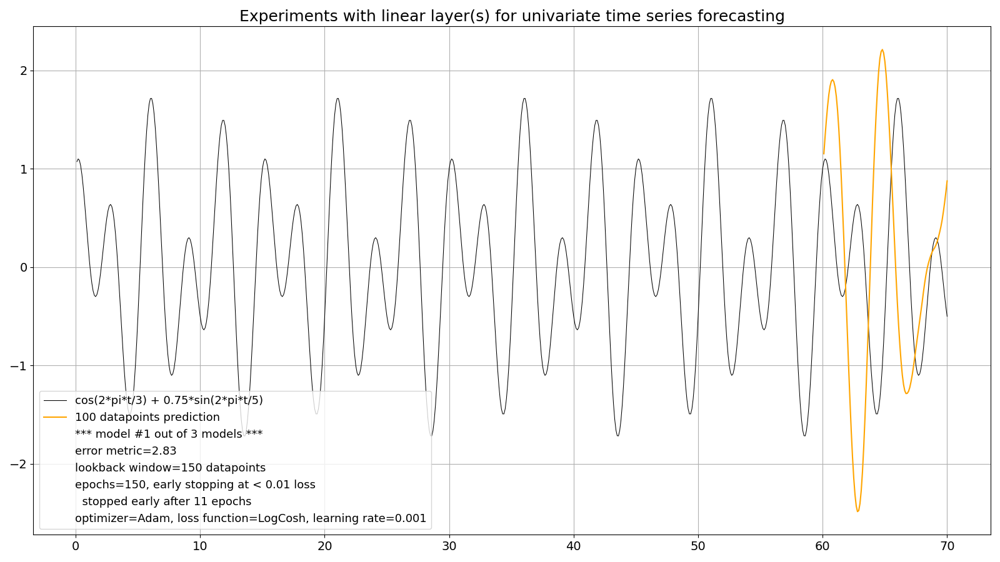

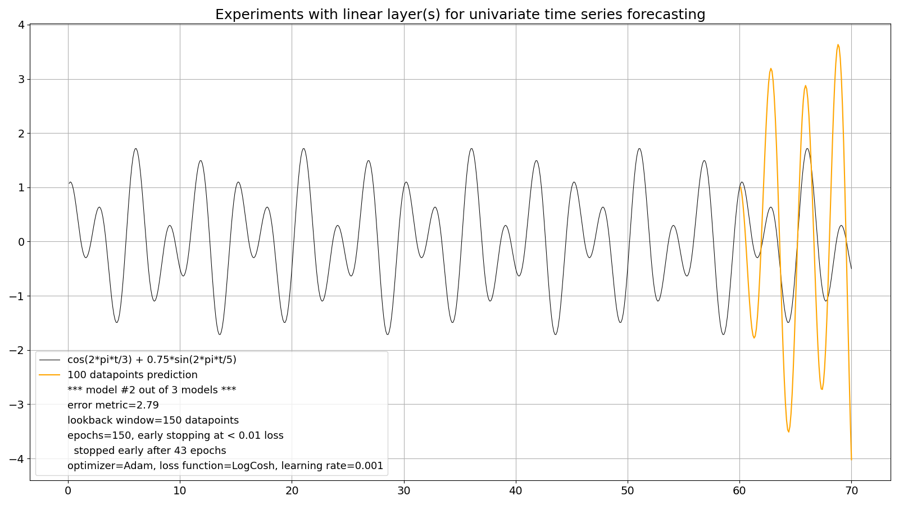

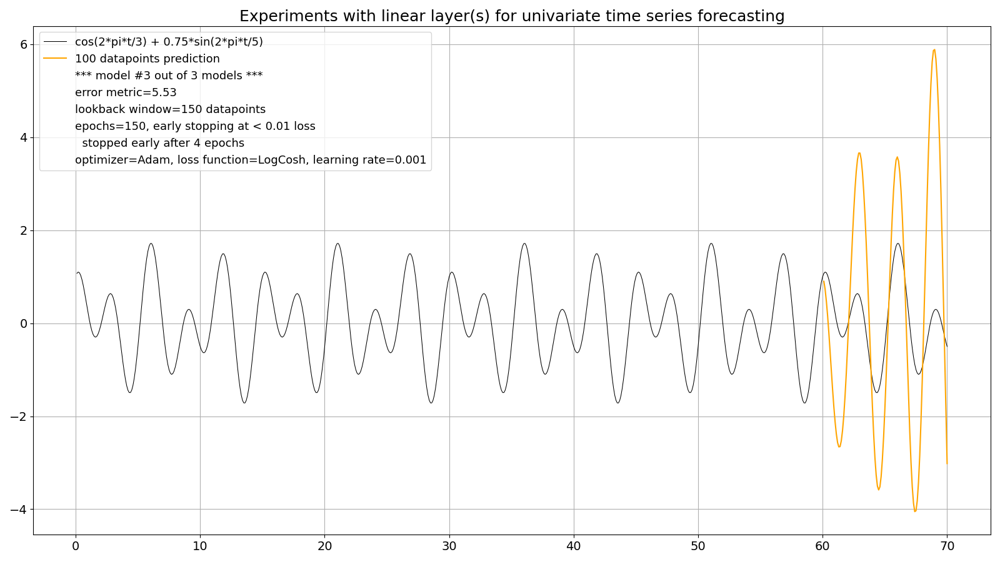

The (recurrent) prediction (of 100 datapoints on the right hand side) features:
* wild over- and under-swings
* phase shifts
* unfinished half-curves (see model #1 of 3 at the very right edge)

The lookback window size was - and still is - set by me to the (known) full period of 150 datapoints (3 * 5 * 10 datapoints). Doubling it didn't help.

Apparently a simple one-layer linear model, which did well at the monthly milk production, is insufficient here, even with a perfectly "clean" time series made of two harmonic oscillations which is even trendless!

### The two-layer model 

So, I added another linear layer (and with a standard ReLU (Rectified Linear Unit) activation function in between.
By the way: you need some kind of activiation between layers, otherwise a second layer would not lead to any improvements! See for example: "Without any activation, a neural network learn will only be able to learn a linear relation between input and the desired output.", https://link.springer.com/chapter/10.1007/978-3-030-31760-7_1)

..and voilà -- the magic of deep learning kicks in :smile:

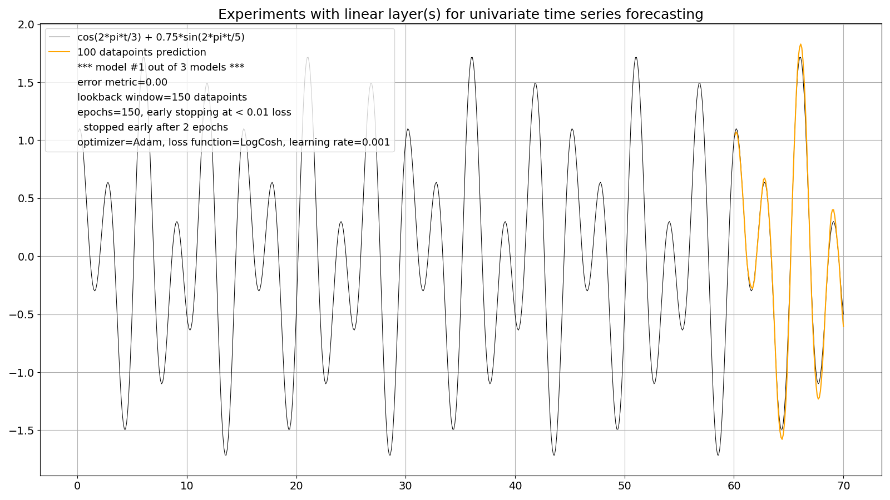

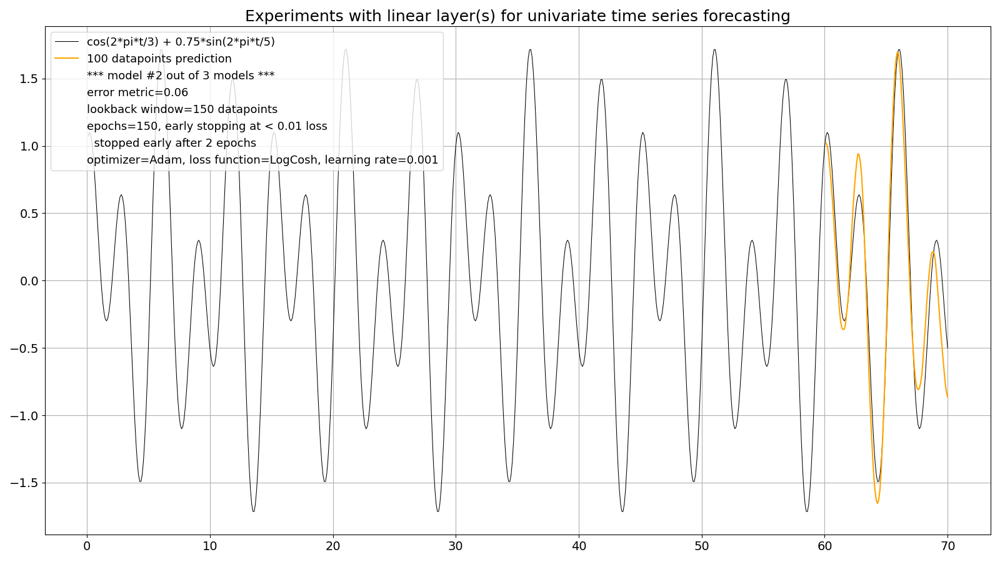

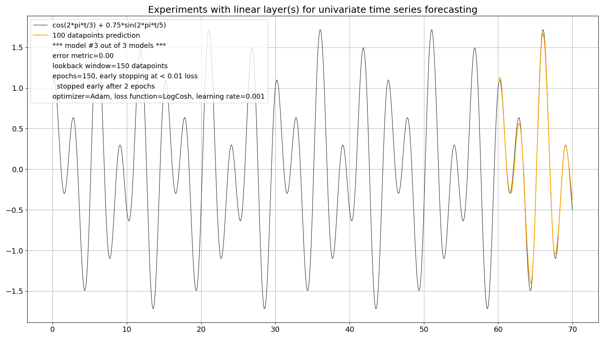

This is the core source code of the linear model with two layers:

```
class Net(T.nn.Module):
    '''
    linear model
    '''
    def __init__(self):
        super().__init__()
        self.layers = T.nn.Sequential(
                        OrderedDict([
                          ('lin1', T.nn.Linear(LOOKBACK_WINDOW, PREDICTION_LENGTH)),
                          ('relu', T.nn.ReLU()),
                          ('lin2', T.nn.Linear(PREDICTION_LENGTH, 1))
                        ]))

    def forward(self, x):
        z = self.layers(x)
        return z
```

### What about some noise? 

So far our experimental time series shouldn't have been too demanding (it isn't because it's still also perfectly **stationary**: https://towardsdatascience.com/stationarity-in-time-series-analysis-90c94f27322)

So, I added some "benign" noise in the form of Gaussian noise (with a maximum amplitude of roughly 20% of the amplitude of the original signal: *np.max(y_noise) / np.max(y_clean)*) to the original, clean signal:

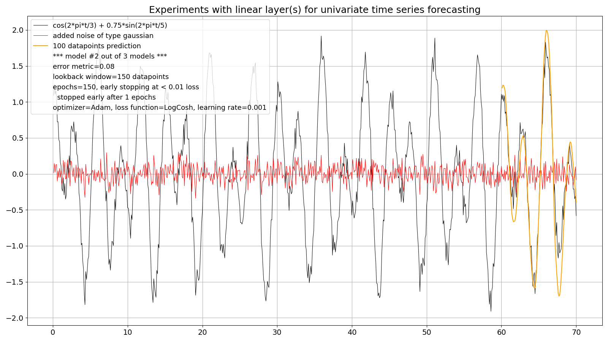

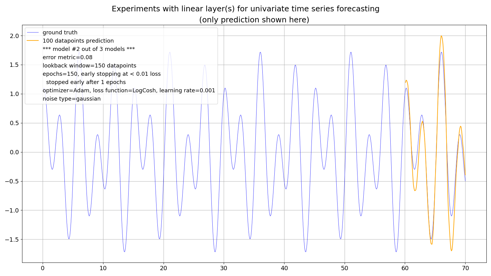

### What about some more noise? 

Not bad, so I added noise with heavier tails than Gaussian noise, here from a Student's t-distribution with 5.0 degrees of freedom (df's; if df's go to infinity this distribution becomes the standard normal distribution):


## The forecasting strategy (part 1)

Like with the monthly milk production this program also applies the **recursive strategy** where only one datapoint is forecast by the model at a time which is then being used to forecast the next datapoint:

```
# do a prediction
# do some initializations first:
x_test_tensor = T.empty(LOOKBACK_WINDOW+PREDICTION_LENGTH)  # past of length LOOKBACK_WINDOW + future (in sample) of length PREDICTION_LENGTH
x_test_ini = T.from_numpy(y[-LOOKBACK_WINDOW-PREDICTION_LENGTH:-PREDICTION_LENGTH])
x_test_tensor[0:LOOKBACK_WINDOW] = x_test_ini

pred_value = np.empty(PREDICTION_LENGTH)

for i in range(LOOKBACK_WINDOW,LOOKBACK_WINDOW+PREDICTION_LENGTH):

    input = x_test_tensor[i-LOOKBACK_WINDOW:i]

    output = model(input)

    pred_value[i-LOOKBACK_WINDOW] = output.detach().numpy()[0]  # tensor to numpy scalar

    # add predicted value to the test tensor!
    # so, no update of test data with in-sample-data:
    x_test_tensor[i] = output
```

## Trend, the straw that broke the camel's back

After these encouraging results with added noise, I took the next step with the synthetic times series and added a trend to the original curve, here as a continuous trend (which I call a "total" trend), being linear and "soft":

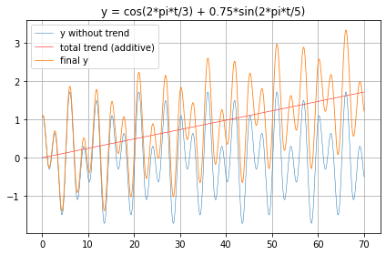

<br/>

However, the prediction quality **in average** became visibly "bad", here model #5 out of 20 models as a low point:

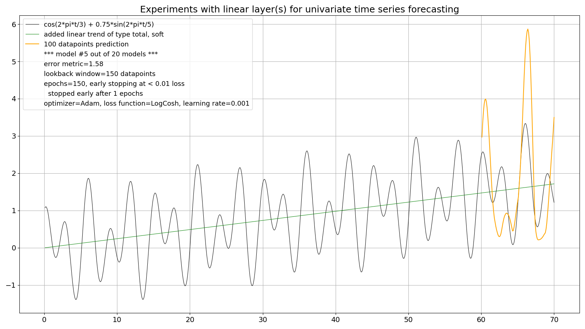

Be aware that this model was trained for only one epoch because this was sufficient to reach the loss limit of 0.01 :astonished:

That didn't mean that no "good" models could be built, here model #20:

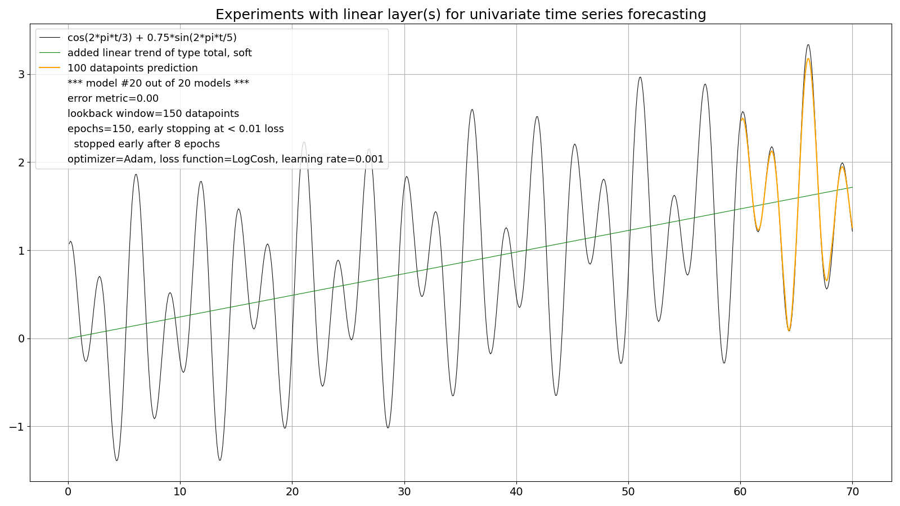

My initial guess was that 1 out of 3 models were "bad". But that was too optimistic as I will explain later.

So I started to make more experiments to see if the prediction quality could be improved at this two-layer model. For example:

* I changed back to the standard Mean squared error (MSE) loss function, to no avail

* I added another linear layer, also to no avail

<br/>

Only then I started to doubt the recursive forecasting strategy, at least with this synthetic times series.

(I didn't test this deterministic curve with trend with my first, one-layer linear model.)

<br/>

This README continues at "The forecasting strategy (part 2)": https://github.com/PLC-Programmer/PyTorch/tree/main/time_series_forecasting/experiments_with_linear_models/01_direct_multiple-step_forecast

##_end
