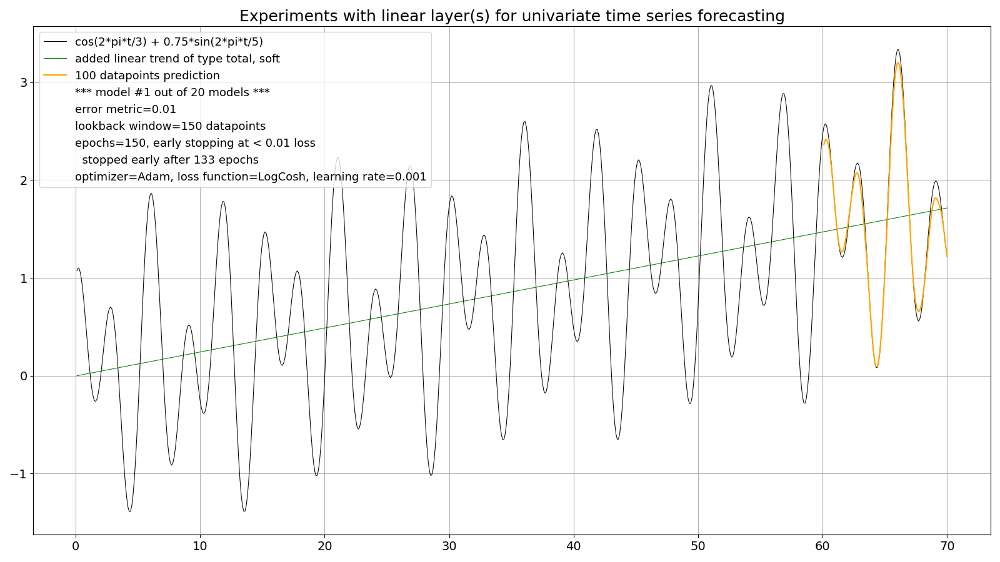
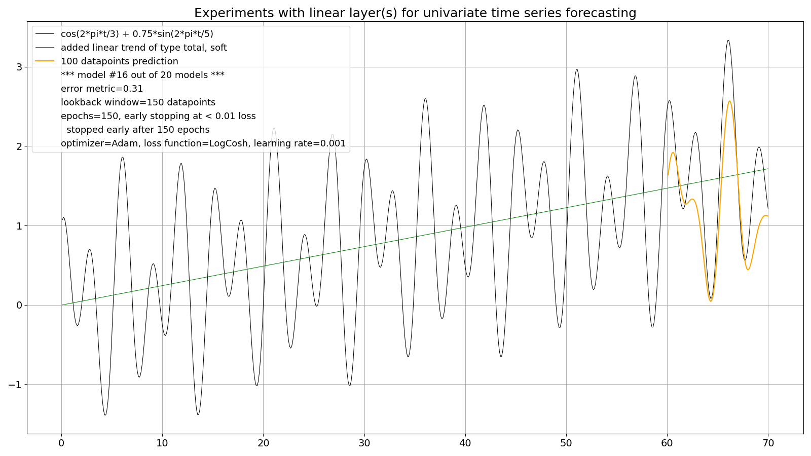

## The forecasting strategy (part 2)

So after experiments with a model which employs the **recursive strategy** (https://github.com/PLC-Programmer/PyTorch/tree/main/time_series_forecasting/experiments_with_linear_models/00_recursive_forecast#trend-the-straw-that-broke-the-camels-back) and its challenges with even simple trends I changed my computer program to employ a **direct multiple-step strategy**:

https://github.com/PLC-Programmer/PyTorch/blob/main/time_series_forecasting/experiments_with_linear_models/01_direct_multiple-step_forecast/Linear_deterministic_curve_forecasting_multiple_step.py

This program forecasts all 100 datapoints of the prediction horizon at a time (in sample). The first results have been encouraging; the prediction quality seemed similar, at least not worst; here arbitrarily model #1 out of 20:



However, still not everything was rosy now as the worst out of 20 models (https://github.com/PLC-Programmer/PyTorch/blob/main/time_series_forecasting/experiments_with_linear_models/01_direct_multiple-step_forecast/01_trend_no_noise/01a_loss_limit_0.010/Linear_deterministic_curve_forecasting_stats.txt) shows:



### More computational effort

A direct multiple-step forecast strategy has its price because, albeit using the structurally same linear model, it employs significantly more parameters than the recursive strategy. Here it's 25,200 versus 15,201 parameters:

```
+--------------------+------------+
|      Modules       | Parameters |
+--------------------+------------+
| layers.lin1.weight |   15000    |
|  layers.lin1.bias  |    100     |
| layers.lin2.weight |   10000    |
|  layers.lin2.bias  |    100     |
+--------------------+------------+
Total trainable parameters: 25200
```

from: https://github.com/PLC-Programmer/PyTorch/blob/main/time_series_forecasting/experiments_with_linear_models/01_direct_multiple-step_forecast/01_trend_no_noise/01a_loss_limit_0.010/Linear_deterministic_curve_forecasting_stats.txt

```
+--------------------+------------+
|      Modules       | Parameters |
+--------------------+------------+
| layers.lin1.weight |   15000    |
|  layers.lin1.bias  |    100     |
| layers.lin2.weight |    100     |
|  layers.lin2.bias  |     1      |
+--------------------+------------+
Total trainable parameters: 15201
```

from: https://github.com/PLC-Programmer/PyTorch/blob/main/time_series_forecasting/experiments_with_linear_models/00_recursive_forecast/00b_two-layer_model/Linear_deterministic_curve_forecasting_stats.txt

And this naturally leads to a higher training effort, be it with a noisey or without a noisy time series, for a comparable prediction quality.

### Relaxing the training effort

Above models have still been trained with the original loss limit of 0.01 which led to a mean epochs value of 112.3 :astonished:

So, I wanted to bring down the training effort to a level more comparable to the level of the recursive strategy without compromising the prediction quality too much (as I thougt initially). There the epoch metrics looked like this (total, soft trend; no noise; 20 models):

* mean epochs = 5.2
* max epochs = 15.0
* min epochs = 1.0

(https://github.com/PLC-Programmer/PyTorch/blob/main/time_series_forecasting/experiments_with_linear_models/00_recursive_forecast/00b_two-layer_model/00b3_experiments_with_trend/Linear_deterministic_curve_forecasting_stats.txt)

So I increased the **loss limit to 0.015** (and all other things equal) which led to these more relaxed metrics:

* **mean epochs = 56.3**
* max epochs = 150.0
* min epochs = 7.0

(https://github.com/PLC-Programmer/PyTorch/blob/main/time_series_forecasting/experiments_with_linear_models/01_direct_multiple-step_forecast/01_trend_no_noise/01b_loss_limit_0.015/Linear_deterministic_curve_forecasting_stats.txt)

To my astonishment also the prediction quality increased! Not one "bad" model within 20 models (I will come later to my definition of a "bad" model):

*model # and LogCosh value:*

*model #1: error metric = 0.01*

*model #2: error metric = 0.01*

*model #3: error metric = 0.01*

*model #4: error metric = 0.01*

*model #5: error metric = 0.01*

*model #6: error metric = 0.01*

*model #7: error metric = 0.01*

*model #8: error metric = 0.01*

*model #9: error metric = 0.01*

*model #10: error metric = 0.01*

*model #11: error metric = 0.02*

*model #12: error metric = 0.01*

*model #13: error metric = 0.04*

*model #14: error metric = 0.00*

*model #15: error metric = 0.01*

*model #16: error metric = 0.00*

*model #17: error metric = 0.01*

*model #18: error metric = 0.01*

*model #19: error metric = 0.01*

*model #20: error metric = 0.01*

again from: https://github.com/PLC-Programmer/PyTorch/blob/main/time_series_forecasting/experiments_with_linear_models/01_direct_multiple-step_forecast/01_trend_no_noise/01b_loss_limit_0.015/Linear_deterministic_curve_forecasting_stats.txt

<br/>

I haven't experimented with more advanced forecasting strategies like "Direct-recursive hybrid multi-step forecasting" or "Multiple output multi-step forecasting": https://machinelearningmastery.com/multi-step-time-series-forecasting/

<br/>

Here's some advice:

*Recursive forecasting is biased when the underlying model is nonlinear, but direct forecasting has higher variance because it uses fewer observations when estimating the model, especially for longer forecast horizons.*

from: https://www.semanticscholar.org/paper/Recursive-and-direct-multi-step-forecasting%3A-the-of-Taieb-Hyndman/432bd2365c8cfebd16577990404d3ff9d05d7e7d

<br/>

This README continues at "The forecasting strategy (part 3/3) -- the 100 models competition": https://github.com/PLC-Programmer/PyTorch/tree/main/time_series_forecasting/experiments_with_linear_models/02_recursive_vs_direct_multiple-step_forecast

##_end
