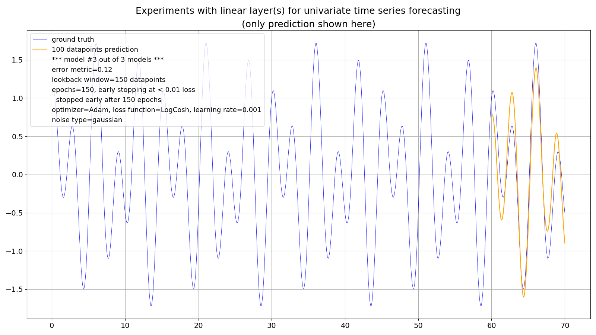

## The forecasting strategy (part 3/3) -- the 100 models competition

After these fabulous results with the direct multiple-step strategy and its relaxed loss limit with a trend, I made a competition with the build and training of 100 models for each forecasting strategy.

Here are some resulting metrics where I define a "bad" model as a model with an error metric (logcosh loss function) greater than 0.05:

metric | recursive | direct
--- | --- | ---
loss limit | 0.010 | 0.015
ratio of "bad" models | 47.0% | 0.0%
mean epochs | 5.5 | 55.6
max epochs | 17.0 | 150.0
min epochs | 1.0 | 5.0
Mean of the errors of all models | 0.12 | 0.01
Variance of the errors of all models | 0.0 | 0.0

It's pretty clear that with a "total", linear and "soft" trend the direct multiple-step strategy wins hands down (at the price of principally more training effort).

### What about noise?

At this point I only had one more question:

How is the direct multiple-step strategy doing with the presence of noise, here with "benign" Gaussian noise with a noise factor of 0.2 and without trend?

Well, one out of three models already had its difficulties (here still with the old loss limit of 0.01):

So, there was no "early stopping" after 150 (training) epochs.

 

Recursive strategy: remember, this is the worst model out of three in the presence of noise with a t-distribution with 5.0 degrees of freedom and a noise factor of **0.5** and which stopped after only **2 epochs**:

https://github.com/PLC-Programmer/PyTorch/tree/main/time_series_forecasting/experiments_with_linear_models/00_recursive_forecast/00b_two-layer_model/00b2_noise_50percent_t_distr

 

 

So far that's it as initially motivated by this paper: https://github.com/PLC-Programmer/PyTorch/tree/main/time_series_forecasting/Are_transformers_effective_for_time_series_forecasting/Linear because I got another idea which makes me stop to experiment with linear models. However, I might come back to them as a base case.

##_end
