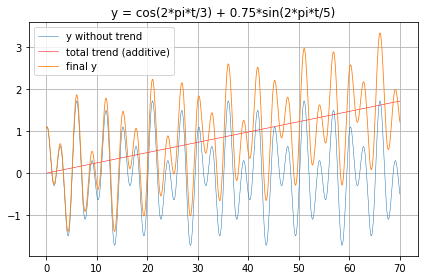

2024-05-12
#### Experimental work to do:

Build and train 100 models for the deterministic curve with a total (that is for the whole time series), constant and "soft" trend (and at first without noise):
* with the recursive forecast strategy and
* with the direct multiple-step forecast strategy.

Then compare: what forecast strategy makes less "bad" predictions?

