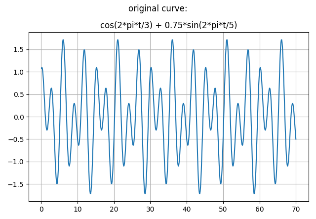
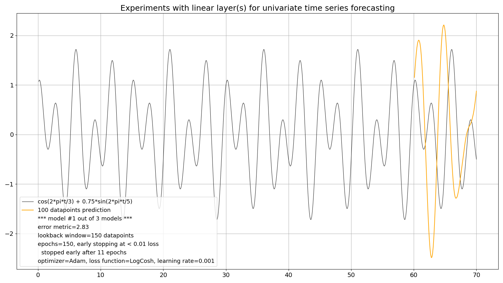
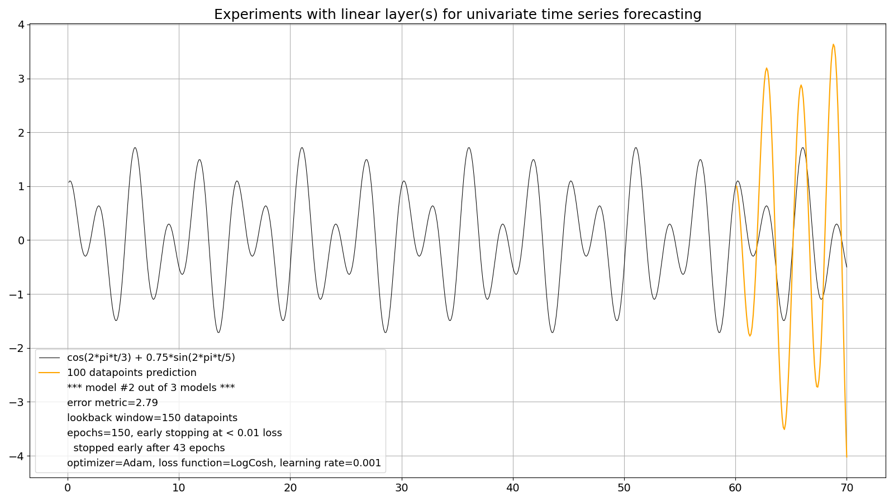
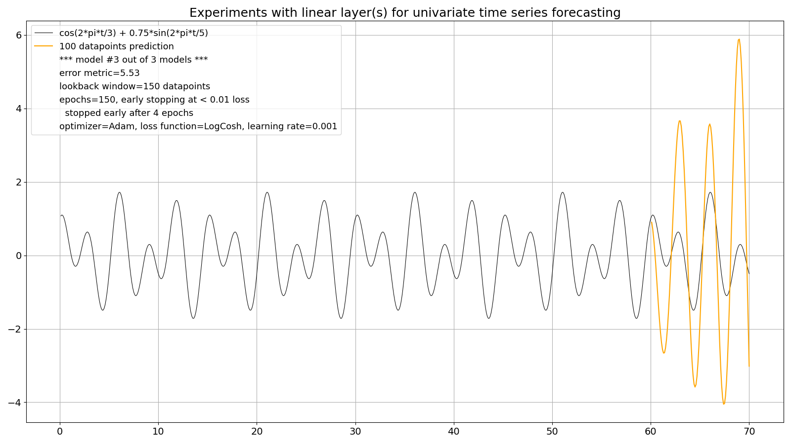
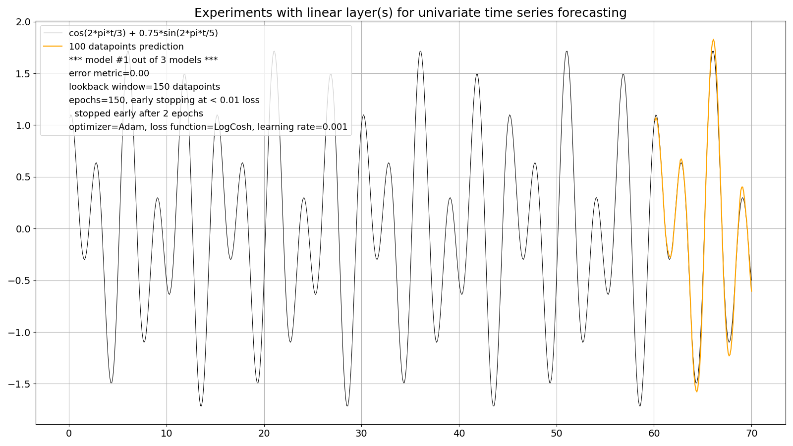
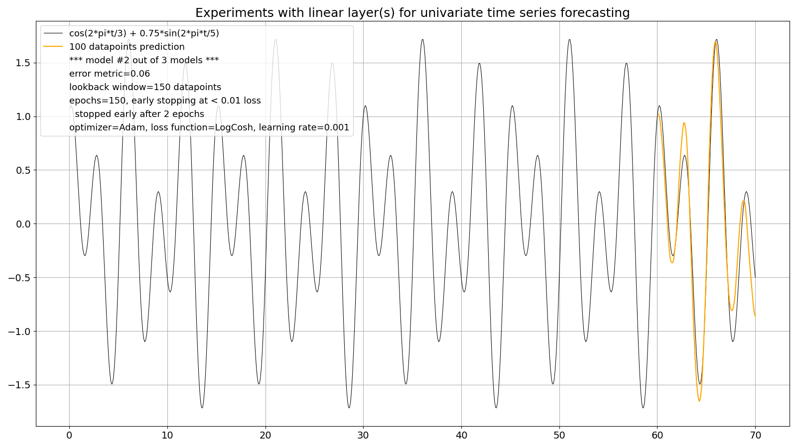
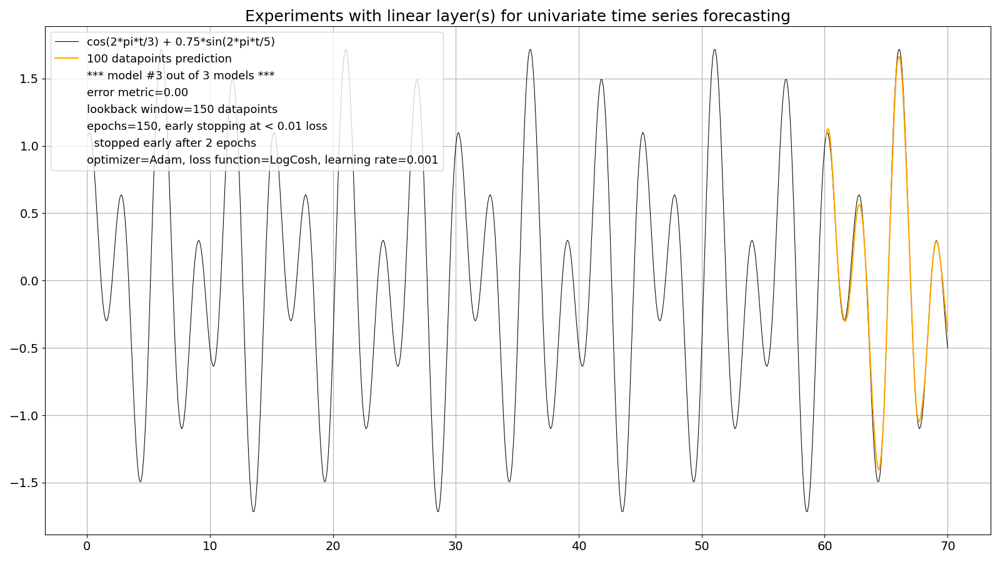
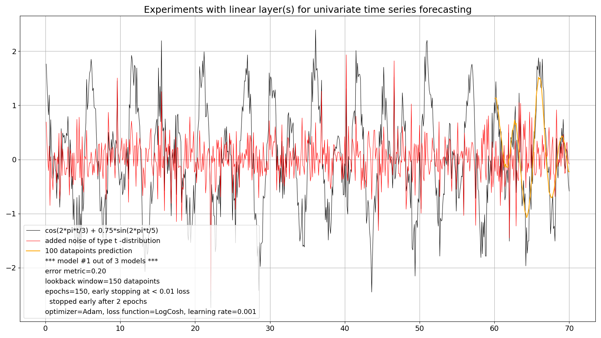
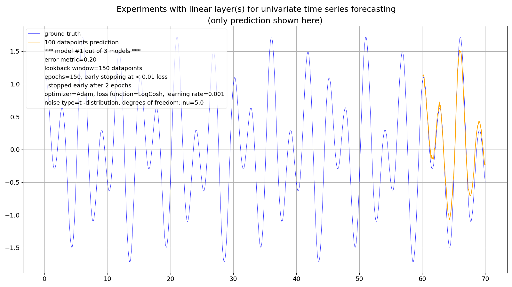

### Synthetic times series 

Sometimes it's easier to experiment with synthetic times series ("deterministic curves") first since it gives you more control over different setups.

I got this idea from here: https://github.com/tgchomia/ts/blob/main/Example.txt

So, this is the time series to experiment with, made of 700 datapoints (70 time units with equal 0.1 time steps):



This is also a "quite seasonal" (univariate) time series, like the monthly milk production (from the real world): https://github.com/PLC-Programmer/PyTorch/tree/main/time_series_forecasting/Linear, made of two harmonic oscillations.

<br/>

However, starting with a one-layer (linear) model led to rather disappointing results like these:







The (recurrent) prediction (of 100 datapoints on the left hand side) features:
* wild over- and under-swings
* phase shifts
* unfinished half-curves (see model #1 of 3)

The lookback window size was - and still is - set by me to the (known) full period of 150 datapoints (3 * 5 * 10 datapoints). Doubling it didn't help.

<br/>

Apparently a simple one-layer linear model, which did well at the monthly milk production, is insufficient here, even with a perfectly "clean" time series made of two harmonic oscillations!

### The two-layer model 

So, I added another linear layer (and with a standard ReLU (Rectified Linear Unit) activation function in between.
By the way: you need some kind of activiation between layers, otherwise a second layer would not lead to any improvements! See for example: "Without any activation, a neural network learn will only be able to learn a linear relation between input and the desired output.", https://link.springer.com/chapter/10.1007/978-3-030-31760-7_1)

..and voilà -- the magic of deep learning kicks in :smile:







This is the core source code of the linear model with two layers:

```
class Net(T.nn.Module):
    '''
    linear model
    '''
    def __init__(self):
        super().__init__()
        self.layers = T.nn.Sequential(
                        OrderedDict([
                          ('lin1', T.nn.Linear(LOOKBACK_WINDOW, PREDICTION_LENGTH)),
                          ('relu', T.nn.ReLU()),
                          ('lin2', T.nn.Linear(PREDICTION_LENGTH, 1))
                        ]))

    def forward(self, x):
        z = self.layers(x)
        return z
```

### What about some noise? 

So far our experimental time series shouldn't have been too demanding (it isn't because its still also perfectly **stationary**: https://towardsdatascience.com/stationarity-in-time-series-analysis-90c94f27322)

So, I added some "benign" noise in the form of Gaussian noise (with a maximum amplitude of roughly 20% of the amplitude of the original signal: *np.max(y_noise) / np.max(y_clean)*) to the original, clean signal:


### What about some more noise? 

Not bad, so I added noise with heavier tails than Gaussian noise, here from a Student's t-distribution with 5.0 degrees of freedom (df's; if df's go to infinity this distribution becomes the standard normal distribution):






