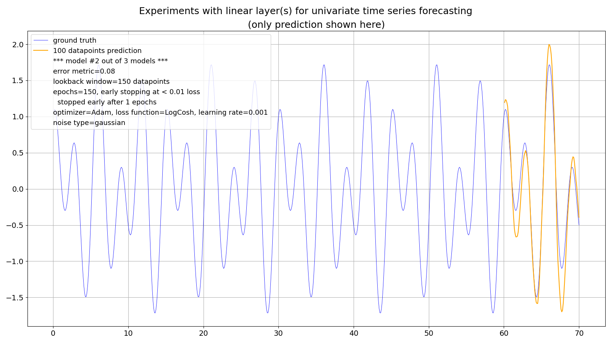

2024-05-12
#### Experimental work to do:

Build and train 100 models for the deterministic curve with a total (that is for the whole time series), constant and "soft" trend (and at first without noise):
* with the recursive forecast strategy and
* with the direct multiple-step forecast strategy.

Then compare: what forecast strategy makes less "bad" predictions?


---

## Synthetic times series

Sometimes it's easier to first experiment with synthetic times series ("deterministic curves") since it gives you more control over different setups.

I got this idea from here: https://github.com/tgchomia/ts/blob/main/Example.txt

So, this is the time series to experiment with, made of 700 datapoints (70 time units with equal 0.1 time steps):


This is also a "quite seasonal" (univariate) time series, like the monthly milk production (from the real world): https://github.com/PLC-Programmer/PyTorch/tree/main/time_series_forecasting/Linear, made of two harmonic oscillations.

Albeit this synthetic times series doesn't feature a **trend**! Cf. https://github.com/PLC-Programmer/PyTorch/tree/main/time_series_forecasting/DLinear

<br/>

However, starting with a one-layer (linear) model led to rather disappointing results like these:


The (recurrent) prediction (of 100 datapoints on the right hand side) features:
* wild over- and under-swings
* phase shifts
* unfinished half-curves (see model #1 of 3 at the very right edge)

The lookback window size was - and still is - set by me to the (known) full period of 150 datapoints (3 * 5 * 10 datapoints). Doubling it didn't help.

Apparently a simple one-layer linear model, which did well at the monthly milk production, is insufficient here, even with a perfectly "clean" time series made of two harmonic oscillations which is even trendless!

### The two-layer model 

So, I added another linear layer (and with a standard ReLU (Rectified Linear Unit) activation function in between.
By the way: you need some kind of activiation between layers, otherwise a second layer would not lead to any improvements! See for example: "Without any activation, a neural network learn will only be able to learn a linear relation between input and the desired output.", https://link.springer.com/chapter/10.1007/978-3-030-31760-7_1)

..and voilà -- the magic of deep learning kicks in :smile:


This is the core source code of the linear model with two layers:

```
class Net(T.nn.Module):
    '''
    linear model
    '''
    def __init__(self):
        super().__init__()
        self.layers = T.nn.Sequential(
                        OrderedDict([
                          ('lin1', T.nn.Linear(LOOKBACK_WINDOW, PREDICTION_LENGTH)),
                          ('relu', T.nn.ReLU()),
                          ('lin2', T.nn.Linear(PREDICTION_LENGTH, 1))
                        ]))

    def forward(self, x):
        z = self.layers(x)
        return z
```

### What about some noise? 

So far our experimental time series shouldn't have been too demanding (it isn't because it's still also perfectly **stationary**: https://towardsdatascience.com/stationarity-in-time-series-analysis-90c94f27322)

So, I added some "benign" noise in the form of Gaussian noise (with a maximum amplitude of roughly 20% of the amplitude of the original signal: *np.max(y_noise) / np.max(y_clean)*) to the original, clean signal:




### What about some more noise? 

Not bad, so I added noise with heavier tails than Gaussian noise, here from a Student's t-distribution with 5.0 degrees of freedom (df's; if df's go to infinity this distribution becomes the standard normal distribution):


## The forecasting strategy

Like with the monthly milk production this program also applies the **recursive strategy** where only one datapoint is forecast by the model at a time which is then being used to forecast the next datapoint:

```
# do a prediction
# do some initializations first:
x_test_tensor = T.empty(LOOKBACK_WINDOW+PREDICTION_LENGTH)  # past of length LOOKBACK_WINDOW + future (in sample) of length PREDICTION_LENGTH
x_test_ini = T.from_numpy(y[-LOOKBACK_WINDOW-PREDICTION_LENGTH:-PREDICTION_LENGTH])
x_test_tensor[0:LOOKBACK_WINDOW] = x_test_ini

pred_value = np.empty(PREDICTION_LENGTH)

for i in range(LOOKBACK_WINDOW,LOOKBACK_WINDOW+PREDICTION_LENGTH):

    input = x_test_tensor[i-LOOKBACK_WINDOW:i]

    output = model(input)

    pred_value[i-LOOKBACK_WINDOW] = output.detach().numpy()[0]  # tensor to numpy scalar

    # add predicted value to the test tensor!
    # so, no update of test data with in-sample-data:
    x_test_tensor[i] = output
```

<br/>

Here's a version of the program where all 100 datapoints of the prediction horizon are forecast by the model at a time (**"direct multiple-step forecast"**): https://github.com/PLC-Programmer/PyTorch/blob/main/time_series_forecasting/experiments_with_linear_models/direct_multiple-step_forecasting/Linear_deterministic_curve_forecasting_multiple_step.py

The prediction quality seems similar:


<br/>

However, a direct multiple-step forecast strategy has its price because, albeit using the structurally same linear model, it employs significantly more parameters than the recursive strategy. Here it's 25,200 versus 15,201 parameters:

```
+--------------------+------------+
|      Modules       | Parameters |
+--------------------+------------+
| layers.lin1.weight |   15000    |
|  layers.lin1.bias  |    100     |
| layers.lin2.weight |   10000    |
|  layers.lin2.bias  |    100     |
+--------------------+------------+
Total trainable parameters: 25200
```

from: https://github.com/PLC-Programmer/PyTorch/blob/main/time_series_forecasting/experiments_with_linear_models/direct_multiple-step_forecasting/outputs/Linear_deterministic_curve_forecasting_stats.txt

```
+--------------------+------------+
|      Modules       | Parameters |
+--------------------+------------+
| layers.lin1.weight |   15000    |
|  layers.lin1.bias  |    100     |
| layers.lin2.weight |    100     |
|  layers.lin2.bias  |     1      |
+--------------------+------------+
Total trainable parameters: 15201
```

from: https://github.com/PLC-Programmer/PyTorch/blob/main/time_series_forecasting/experiments_with_linear_models/20percent_Gaussian_noise/Linear_deterministic_curve_forecasting_stats.txt

And this naturally leads to a higher training effort, be it with a noisey or without a noisy time series, for a comparable prediction quality.

<br/>

I haven't experimented with more advanced forecasting strategies like "Direct-recursive hybrid multi-step forecasting" or "Multiple output multi-step forecasting": https://machinelearningmastery.com/multi-step-time-series-forecasting/

<br/>

Here's some advice:

*Recursive forecasting is biased when the underlying model is nonlinear, but direct forecasting has higher variance because it uses fewer observations when estimating the model, especially for longer forecast horizons.*

from: https://www.semanticscholar.org/paper/Recursive-and-direct-multi-step-forecasting%3A-the-of-Taieb-Hyndman/432bd2365c8cfebd16577990404d3ff9d05d7e7d

##_end
