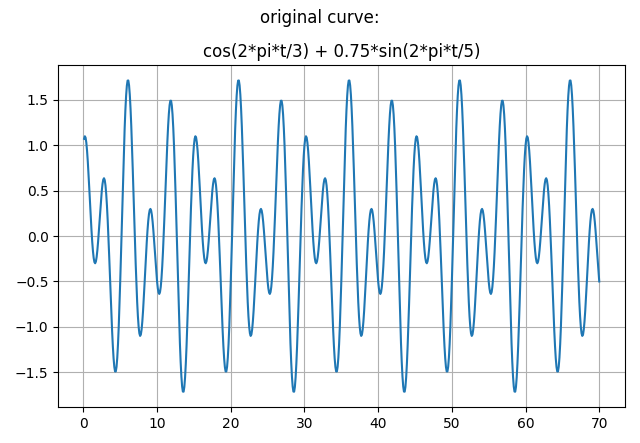

(**Work in progress**)

My first experiments on this deterministic curve..

..employed the **recursive forecast strategy**, that is where only one datapoint is forecast by the model at a time which is then being used to forecast the next datapoint and this concept being employed over the total prediction horizon (of 100 datapoints).

However, this concept started to show visibly "bad" prediction qualities **in average**, when a trend, here a "total" trend, that is a continuous, linear and "soft" trend being added to the original curve:

This was already true for the improved two-layer linear model, a model which also did well with a noisy but trendless curve. (I didn't test the deterministic curve with trend with my very first, one-layer linear model.)

 

---

(experiments with trends and their results...)

---

(original text: "Synthetic times series"...)

